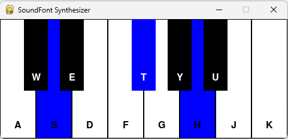

# SoundFont Synthesizer
A simple one-octave synthesizer using FluidSynth and a SoundFont

## Instructions

1. To run the app, you need to first download and install the FluidSynth library from here:
  https://github.com/FluidSynth/fluidsynth/releases 
Download fluidsynth-2.4.2-win10-x64.zip, unzip the folder, put it someplace on your system and add an environment path to the bin folder.

2. Download or clone the repo to run the code, unzip it, and put it somewhere on your drive.

3. Download a sound font file, like this one, Dore Mark's NY S&S Model B-v5.2.sf2
  https://drive.google.com/file/d/1nvTy62-wHGnZ6CKYuPNAiGlKLtWg9Ir9/view 
Place the SoundFont file in the soundfont_synthesizer folder.

4. Install these projects with pip:
   pygame pyfluidsynth

5. Run the soundfont_synthesizer.py file, and you should see this and be able to play. Blue indicates the pressed notes.
